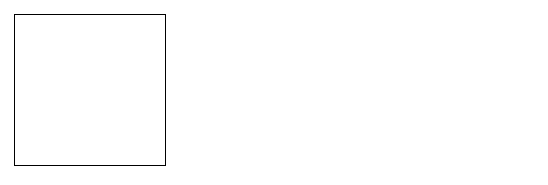

## 캔버스 기본 사용법

```html
<canvas id="tutorial" width="150" height="150"></canvas>
```

`canvas`요소에는 `width`와 `height` 두 속성만 있다. <br>
지정하지 않으면 width는 300, height는 150이 디폴트 값이다.<br>
CSS로 임의로 크기를 정할 수 있지만 렌더링하는 동안 이미지는 레이아웃 크기에 맞게 크기가 조정된다. 크기 지정이 초기 캔버스의 비율을 고려하지 않으면 왜곡되어 나타난다. 만약 왜곡된 것처럼 보이는 경우 CSS를 사용하지 말고 `canvas` 속성에서 `width`와 `height`를 명시적으로 지정하자.

<br>

### 렌더링 컨텍스트

`<canvas>` 엘리먼트는 고정 크기의 드로잉 영역을 생성하고 하나 이상의 **렌더링 컨텍스**를 노출한다. <br>

캔버스는 처음에 빈 상태이며 무언가를 표시하려면 렌더링 컨텍스트에 접근해야 한다. `getContext()` 메서드를 이용한다. 렌더링 컨텍스트 타입을 지정하는 하나의 파라미터를 가지는데 예시에선 2D그래픽을 위해 2d로 지정했다.

```javascript
const canvas = document.getElementById('tutorial');
const ctx = canvas.getContext('2d');
```

<br>
아래는 간단한 예제다

```html
<!DOCTYPE html>
<html>
  <head>
    <meta charset="utf-8" />
    <title>Canvas tutorial</title>
    <script type="text/javascript">
      function draw() {
        const canvas = document.getElementById('tutorial');
        if (canvas.getContext) {
          const ctx = canvas.getContext('2d');
        }
      }
    </script>
    <style type="text/css">
      canvas {
        border: 1px solid black;
      }
    </style>
  </head>
  <body onload="draw();">
    <canvas id="tutorial" width="150" height="150"></canvas>
  </body>
</html>
```

<br>
결과



js에서 `draw` 함수를 만들고 `body`에 `onload`로 로딩 시 함수를 실행한다.
