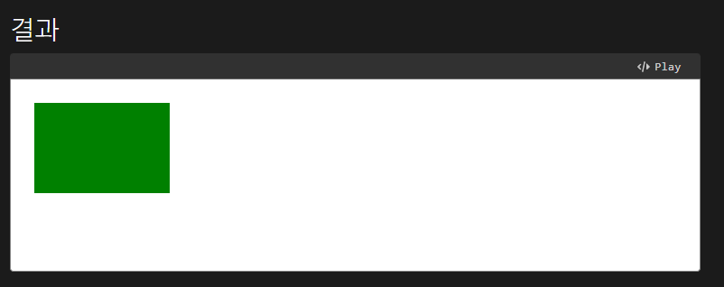

## 캔버스란?

**Canvas API**는 JS와 HTML의 `<canvas>` 엘리먼트를 통해 그래픽을 그리기위한 수단을 제공한다. 주로 2D에 중점을 두고 있고 **WebGL API** 또한 `<canvas>`를 사용해 2D나 3D를 그린다.

### 기본 예시

```html
<canvas id="canvas"></canvas>
```

```javascript
const canvas = document.getElementById('canvas');
const ctx = canvas.getContext('2d');

ctx.fillStyle = 'green';
ctx.fillRect(10, 10, 150, 100);
```



여기서 `getContext(contextType, contextAttributes)`는 캔버스의 드로잉 컨텍스트를 반환하는 메소드로 비어있는 `canvas`요소에 접근해서 그릴 수 있게 한다. `constextType`에 가능한 값은 `2d`, `webgl`, `webgl2`, `bitmaprenderer`이며 `contextAttributes`는 렌더링 컨텍스트를 생성할 때 몇 가지 속성을 사용할 수 있다.

https://developer.mozilla.org/ko/docs/Web/API/HTMLCanvasElement/getContext

실제 그리기는 `CanvasRenderingContext2D` 인터페이스를 사용해 수행한다.
예시에서 나온 `CanvasRenderingContext2D.fillStyle` 프로퍼티는 색깔이나 그래디언트, 패턴등을 스타일 할 때 사용한다.

`fillRext`메소드는 좌측 상단 (10, 10) 위치에 너비 150 높이 100인 사각형을 만든다.

<br>
<br>

---

예시 코드는 여기서 확인 할 수 있다. <br>
https://developer.mozilla.org/ko/play
