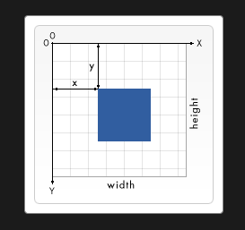
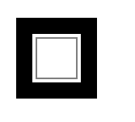

## 캔버스를 사용해 도형 그리기

### 직사각형 그리기



캔버스 그리드는 이렇게 생겼다.

직사각형을 그리는데에는 세가지 함수가 있다.

- fillRect(x, y, width, height) <br>
  색칠된 직사각형을 그린다.
- strokeRect(x, y, width, height)<br>
  직사각형 윤곽선을 그린다.
- clearRect(x, y, width, height)<br>
  특정 부분을 지우는 직사각형을 그린다.

<br>
결과는 다음과 같이 나온다.

```html
<canvas id="canvas"></canvas>
```

```javascript
const canvas = document.getElementById('canvas');
const ctx = canvas.getContext('2d');

ctx.fillRect(25, 25, 100, 100);
ctx.clearRect(45, 45, 60, 60);
ctx.strokeRect(50, 50, 50, 50);
```


