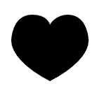

## 캔버스를 사용해 도형 그리기

### 직사각형 그리기


캔버스 그리드는 이렇게 생겼다.

직사각형을 그리는데에는 세가지 함수가 있다.

- fillRect(x, y, width, height) <br>
  색칠된 직사각형을 그린다.
- strokeRect(x, y, width, height)<br>
  직사각형 윤곽선을 그린다.
- clearRect(x, y, width, height)<br>
  특정 부분을 지우는 직사각형을 그린다.

<br>
결과는 다음과 같이 나온다.

```html
<canvas id="canvas"></canvas>
```

```javascript
const canvas = document.getElementById('canvas');
const ctx = canvas.getContext('2d');

ctx.fillRect(25, 25, 100, 100);
ctx.clearRect(45, 45, 60, 60);
ctx.strokeRect(50, 50, 50, 50);
```


<br>

### 경로 그리기

경로를 그리는데 사용하는 몇 가지 함수들

- beginPath() : 새로운 경로를 만든다. 이후 그리기 명령들은 경로를 구성하고 만드는데 사용하게 된다. 이걸로 시작해야지 그린다!
- strokeStyle : 선의 스타일을 지정한다.
- moveTo(x, y) : 펜을 x와 y로 지정된 좌표로 옮긴다. `beginPath()` 메소드가 호출되었을 때, 특정 시작점을 위해 `moveTo()` 함수를 사용하는 것이 좋다. 또한 `moveTo()` 함수는 연결되지 않은 경로를 그리는데에도 사용할 수 있다.
- lineTo(x, y) : 시작점에서 부터 해당 위치까지 선을 긋는다.
- stroke() : 윤곽선을 이용해 도형을 그린다. 안하면 도형 안 그려짐
- closePath() : 현재 하위 경로의 시작 부분과 연결된 직선을 추가한다.
- fill() : 경로의 내부를 채운다. 색을 채우려면 `fillStyle`을 사용하자.
- arc(x, y, r, sAngle, eAngle, counterclockwise) : x, y는 중간점이고 r은 반지름, sAngle과 eAngle은 시작 지점과 끝 지점이다. Math.PI로 한다. `anticlockwise`는 `true`일 때 호를 반시계 방향으로 그리게 된다. 생략하면 `true`
  

<br>
<br>

경로를 만들기 위해선 먼저 `beginPath()` 메소드를 사용한다. 이 메소드가 호출될 때 마다 하위 경로의 모음은 초기화되며 새로운 도형을 그릴 수 있다.

다음은 `moveTo()` 메소드를 사용한다. 실제 경로의 시작점을 찍는다.

그리고 선택사항으로는 `closePath()`다. 현재 점의 위치와 시작점의 위치를 직선으로 이어서 도형을 닫는 메소드인데 이미 도형이 닫혔거나 한 점만 존재한다면 사용하지 않아도 된다.

**참고** <br>
`fill()` 메소드 호출 시, 열린 도형은 자동으로 닫히게 돼서 `closePath()` 메소드를 호출하지 않아도 된다. `stroke()`에는 적용되지 않는다.

<br>

### 예제

1. 스마일

```html
<html>
  <body onload="draw();">
    <canvas id="canvas" width="150" height="150"></canvas>
  </body>
</html>
```

```javascript
var canvas = document.getElementById('canvas');
var ctx = canvas.getContext('2d');

ctx.beginPath();
ctx.arc(75, 75, 50, 0, Math.PI * 2, true); // Outer circle
ctx.moveTo(110, 75);
ctx.arc(75, 75, 35, 0, Math.PI, false); // Mouth (clockwise)
ctx.moveTo(65, 65);
ctx.arc(60, 65, 5, 0, Math.PI * 2, true); // Left eye
ctx.moveTo(95, 65);
ctx.arc(90, 65, 5, 0, Math.PI * 2, true); // Right eye
ctx.stroke();
```


2. 집 그리기

```html
<canvas id="my-house" width="300" height="300"></canvas>
```

```javascript
const canvas = document.getElementById('my-house');
const ctx = canvas.getContext('2d');

// Set line width
ctx.lineWidth = 10;

// Wall
ctx.strokeRect(75, 140, 150, 110);

// Door
ctx.fillRect(130, 190, 40, 60);

// Roof
ctx.beginPath();
ctx.moveTo(50, 140);
ctx.lineTo(150, 60);
ctx.lineTo(250, 140);
ctx.closePath();
ctx.stroke();
```


<br>

### 베지어 곡선과 이차 곡선


- 이차 곡선 `quadraticCurveTo(cp1x, cp1y, x, y)` <br>
   <br>
  이게 베지어 곡선이다. `x`, `y` 변수는 끝점, `cp1x`, `cp1y`는 시작점으로 이차 베지어 곡선을 그린다.

<br>

- 베지어 곡선 `bezierCurveTo(cp1x, cp2x, x, y)` <br>
   <br>
  똑같은데 이건 삼차 베지어 곡선을 그린다.

<br><br>

**예제**

```javascript
// Quadratric curves example
ctx.beginPath();
ctx.moveTo(75, 25);
ctx.quadraticCurveTo(25, 25, 25, 62.5);
ctx.quadraticCurveTo(25, 100, 50, 100);
ctx.quadraticCurveTo(50, 120, 30, 125);
ctx.quadraticCurveTo(60, 120, 65, 100);
ctx.quadraticCurveTo(125, 100, 125, 62.5);
ctx.quadraticCurveTo(125, 25, 75, 25);
ctx.stroke();
```

 <br>

```javascript
// Cubic curves example
ctx.beginPath();
ctx.moveTo(75, 40);
ctx.bezierCurveTo(75, 37, 70, 25, 50, 25);
ctx.bezierCurveTo(20, 25, 20, 62.5, 20, 62.5);
ctx.bezierCurveTo(20, 80, 40, 102, 75, 120);
ctx.bezierCurveTo(110, 102, 130, 80, 130, 62.5);
ctx.bezierCurveTo(130, 62.5, 130, 25, 100, 25);
ctx.bezierCurveTo(85, 25, 75, 37, 75, 40);
ctx.fill();
```

 <br>

<br>

### 직사각형

직사각형은 간단히 그릴 수 있다. 바로 `rect(x, y, width, height)` 이다.

<br>

### 조합하기

```javascript
const canvas = document.getElementById('canvas');
const ctx = canvas.getContext('2d');

roundedRect(ctx, 12, 12, 150, 150, 15);
roundedRect(ctx, 19, 19, 150, 150, 9);
roundedRect(ctx, 53, 53, 49, 33, 10);
roundedRect(ctx, 53, 119, 49, 16, 6);
roundedRect(ctx, 135, 53, 49, 33, 10);
roundedRect(ctx, 135, 119, 25, 49, 10);

ctx.beginPath();
ctx.arc(37, 37, 13, Math.PI / 7, -Math.PI / 7, false);
ctx.lineTo(31, 37);
ctx.fill();

for (var i = 0; i < 8; i++) {
  ctx.fillRect(51 + i * 16, 35, 4, 4);
}

for (i = 0; i < 6; i++) {
  ctx.fillRect(115, 51 + i * 16, 4, 4);
}

for (i = 0; i < 8; i++) {
  ctx.fillRect(51 + i * 16, 99, 4, 4);
}

ctx.beginPath();
ctx.moveTo(83, 116);
ctx.lineTo(83, 102);
ctx.bezierCurveTo(83, 94, 89, 88, 97, 88);
ctx.bezierCurveTo(105, 88, 111, 94, 111, 102);
ctx.lineTo(111, 116);
ctx.lineTo(106.333, 111.333);
ctx.lineTo(101.666, 116);
ctx.lineTo(97, 111.333);
ctx.lineTo(92.333, 116);
ctx.lineTo(87.666, 111.333);
ctx.lineTo(83, 116);
ctx.fill();

ctx.fillStyle = 'white';
ctx.beginPath();
ctx.moveTo(91, 96);
ctx.bezierCurveTo(88, 96, 87, 99, 87, 101);
ctx.bezierCurveTo(87, 103, 88, 106, 91, 106);
ctx.bezierCurveTo(94, 106, 95, 103, 95, 101);
ctx.bezierCurveTo(95, 99, 94, 96, 91, 96);
ctx.moveTo(103, 96);
ctx.bezierCurveTo(100, 96, 99, 99, 99, 101);
ctx.bezierCurveTo(99, 103, 100, 106, 103, 106);
ctx.bezierCurveTo(106, 106, 107, 103, 107, 101);
ctx.bezierCurveTo(107, 99, 106, 96, 103, 96);
ctx.fill();

ctx.fillStyle = 'black';
ctx.beginPath();
ctx.arc(101, 102, 2, 0, Math.PI * 2, true);
ctx.fill();

ctx.beginPath();
ctx.arc(89, 102, 2, 0, Math.PI * 2, true);
ctx.fill();

// A utility function to draw a rectangle with rounded corners.

function roundedRect(ctx, x, y, width, height, radius) {
  ctx.beginPath();
  ctx.moveTo(x, y + radius);
  ctx.lineTo(x, y + height - radius);
  ctx.arcTo(x, y + height, x + radius, y + height, radius);
  ctx.lineTo(x + width - radius, y + height);
  ctx.arcTo(x + width, y + height, x + width, y + height - radius, radius);
  ctx.lineTo(x + width, y + radius);
  ctx.arcTo(x + width, y, x + width - radius, y, radius);
  ctx.lineTo(x + radius, y);
  ctx.arcTo(x, y, x, y + radius, radius);
  ctx.stroke();
}
```


이 예제에서 중점으로 봐야할 점은 `fillStyle`로 색을 넣은 점과, 유틸리티 함수로 만든 `roundedRect()` 부분이다. 이렇게 함수로 사용해서 코드의 양과 복잡함을 줄여주면 좋다.

<br>

### Path2D

코드를 단순화하고 성능을 향상시키기 위해 최근 버전 브라우저에서 사용할 수 있는 메소드다. 객체로 저장할 수 있어서 빠르게 다시 사용할 수 있다.

```javascript
var rectangle = new Path2D();
rectangle.rect(10, 10, 50, 50);

var circle = new Path2D();
circle.moveTo(125, 35);
circle.arc(100, 35, 25, 0, 2 * Math.PI);

ctx.stroke(rectangle);
ctx.fill(circle);
```


또 `SVG path data`를 사용해서 SVG에서 재사용 할 수 있다.
