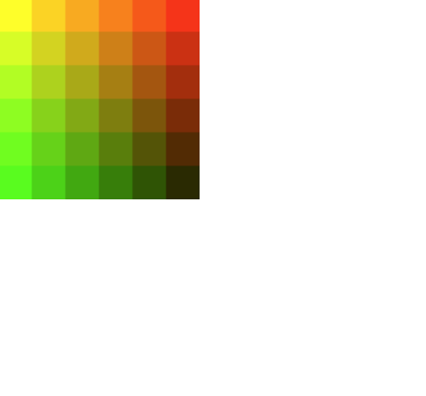
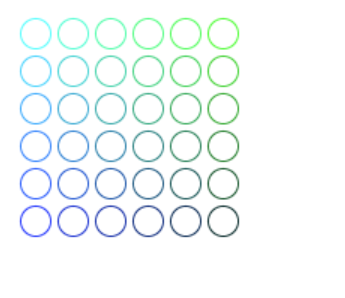
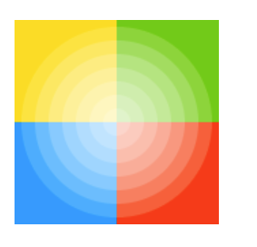
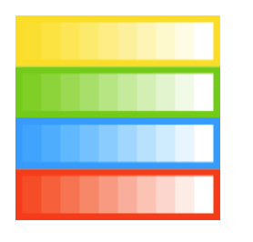

## 스타일과 색 적용하기

이번엔 다른 색상, 선 스타일, 그레디언트, 패턴 및 그림자를 추가하는 방법을 알아보자.

<br>

### 색상

- fillStyle = color : 도형의 색을 정한다.
- strokeStyle = color : 도형의 윤곽선 색을 정한다.

여기서 color는 CSS의 color, 그라디언트 객체, 패턴 객체를 뜻한다.

```javascript
ctx.fillStyle = 'orange';
ctx.fillStyle = '#FFA500';
ctx.fillStyle = 'rgb(255, 165, 0)';
ctx.fillStyle = 'rgba(255, 165, 0, 1)';
```

#### 1. **fillStyle 예제**

```javascript
function draw() {
  var ctx = document.getElementById('canvas').getContext('2d');
  for (var i = 0; i < 6; i++) {
    for (var j = 0; j < 6; j++) {
      ctx.fillStyle = 'rgb(' + Math.floor(255 - 42.5 * i) + ', ' + Math.floor(255 - 42.5 * j) + ', 0)';
      ctx.fillRect(j * 25, i * 25, 25, 25);
    }
  }
}
draw();
```



<br>

#### 2. **strokeStyle 예제**

```javascript
function draw() {
  var ctx = document.getElementById('canvas').getContext('2d');
  for (var i = 0; i < 6; i++) {
    for (var j = 0; j < 6; j++) {
      ctx.strokeStyle = 'rgb(0, ' + Math.floor(255 - 42.5 * i) + ', ' + Math.floor(255 - 42.5 * j) + ')';
      ctx.beginPath();
      ctx.arc(12.5 + j * 25, 12.5 + i * 25, 10, 0, Math.PI * 2, true);
      ctx.stroke();
    }
  }
}

draw();
```



<br>

### 투명도

`globalAlpha` 값을 사용해 투명도를 설정할 수 있다.

**globalAlpha = transparencyValue** 로 투명도가 설정되면 이후 캔버스에 그려지는 모든 도형의 투명도가 변경됩니다.

때문에 각각의 도형의 투명도를 조절하려면 fillStyle이나 strokeStyle에서 `rgba`를 사용해서 각 도형의 투명도를 조절하면 된다.

1. globalAlpha 예제

```javascript
function draw() {
  var ctx = document.getElementById('canvas').getContext('2d');
  // 배경을 그린다
  ctx.fillStyle = '#FD0';
  ctx.fillRect(0, 0, 75, 75);
  ctx.fillStyle = '#6C0';
  ctx.fillRect(75, 0, 75, 75);
  ctx.fillStyle = '#09F';
  ctx.fillRect(0, 75, 75, 75);
  ctx.fillStyle = '#F30';
  ctx.fillRect(75, 75, 75, 75);
  ctx.fillStyle = '#FFF';

  // 투명값을 설정한다
  ctx.globalAlpha = 0.2;

  // 반투명한 원을 그린다
  for (var i = 0; i < 7; i++) {
    ctx.beginPath();
    ctx.arc(75, 75, 10 + 10 * i, 0, Math.PI * 2, true);
    ctx.fill();
  }
}
```



<br>

2. rgba 예제

```javascript
function draw() {
  var ctx = document.getElementById('canvas').getContext('2d');

  // 배경을 그린다
  ctx.fillStyle = 'rgb(255,221,0)';
  ctx.fillRect(0, 0, 150, 37.5);
  ctx.fillStyle = 'rgb(102,204,0)';
  ctx.fillRect(0, 37.5, 150, 37.5);
  ctx.fillStyle = 'rgb(0,153,255)';
  ctx.fillRect(0, 75, 150, 37.5);
  ctx.fillStyle = 'rgb(255,51,0)';
  ctx.fillRect(0, 112.5, 150, 37.5);

  // 반투명한 사각형을 그린다
  for (var i = 0; i < 10; i++) {
    ctx.fillStyle = 'rgba(255,255,255,' + (i + 1) / 10 + ')';
    for (var j = 0; j < 4; j++) {
      ctx.fillRect(5 + i * 14, 5 + j * 37.5, 14, 27.5);
    }
  }
}
```



<br>

### 선 모양

- **lineWidth** = value : 선 두께를 설정합니다.
- **lineCap** = type : 선의 끝 모양을 설정합니다.
- **lineJoin** = type : 선들이 만나는 모서리 모양을 설정합니다.
- **miterLimit** = value : 두 선이 예각으로 만날 때 접합점의 두께를 제어할 수 있도록, 연결부위의 크기를 제한하는 값을 설정합니다.
- **getLineDash** : 음수가 아닌 짝수를 포함하는 현재 선의 대시 패턴 배열을 반환합니다.
- **setLineDash** : 현재 선의 대시 패턴을 설정합니다.
- **lineDashOffset** = value : 선의 대시 배열이 어디서 시작될지 지정합니다.

<br>

1. **lineWidth** 예제
