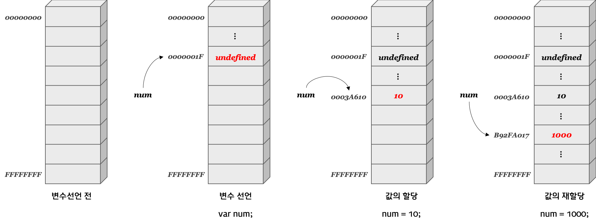

### 데이터 타입과 변수



<br>

- 데이터 타입
  <br>
  8가지 데이터 타입이 있다.

- 원시 타입
  - number
  - string
  - boolean
  - null
  - undefined
  - symbol
  - BigInt
- 객체 타입
  - object
    <br>

1. 원시타입
<br> 원시 타입은 변경 불가능한 값이다. 무슨 말이냐면

```javascript
let str = 'Hello';
str = 'world';
```

라는 코드가 있다. 두번재 구문이 실행되면 이전에 생성된 문자열 Hello를 수정하는 것이 아니라 world를 메모리에 생성하고, 식별자 str을 가리키도록 변경한 것이다.
즉, Hello와 world 모두 메모리에 존재하고 있다.

- 문자열
   <br>
  문자열은 배열처럼 인덱스를 통해 접근할 수 있다. 이와 같은 특성을 갖는 데이터를 *유사배열*이라고 한다.
  str[0] = 'A' 처럼 이미 생성된 문자열의 일부 문자를 변경할 수 없다! 그래서 새로운 문자열을 할당해야 한다.

- boolean
  <br>
  true와 false만 있다.
  빈 문자열과 null, undefined, 숫자 0은 false로 간주된다.

- undefined
   <br>
  undifined는 선언 이후 값을 할당하지 않은 변수는 undefined다.
  값이 없다는 것을 명시하고 싶다면 *null*을 사용하면 된다.
  <br>

특이한 점이 있는데 typeof 연산자로 null을 찍으면 object가 나오는데 이건 자바스크립트 설계상의 오류다.
타입 확인하고 싶으면 일치 연산자를 사용하면 된다.


<br>

2. 객체 타입
     <br>객체는 이름과 값을 가지는 데이터를 의미하는 프로퍼티와 동작을 의미하는 메소드를 포함할 수 있는 독립적 주체다.
   자바스크립트는 객체기반 스크립트 언어여서 자바스크립트의 거의 모든 것이 객체다. 원시 타입을 제외한 나머지가 다 객체다.  <br>  <br>
3. 변수
  <br>변수는 let, const 키워드를 사용해 선언하고 값을 할당하고 식별자인 변수명을 사용해 저장된 값을 참조한다.
변수명은 상세히 적어서 의미를 명확하게 하는 것이 코드 가독성에 좋다.
