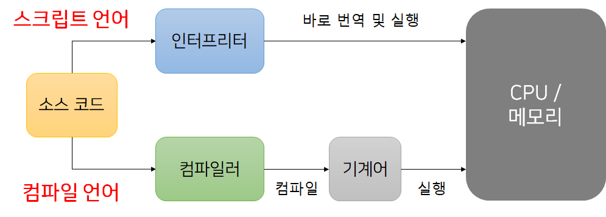

## 자바스크립트란?

---

### 자바스크립트의 탄생

정적인 HTML을 동적으로 표현하기 위해 탄생했다.

### 자바스크립트 표준화 (ECMA)

자바스크립트 파생 버전인 JScript를 만들었었는데 자바스크립트와 크로스 브라우징 이슈가 생기는 문제점이 있어서 ECMA 인터내셔널이라는 비영리 표준화 기구에서
표준화로 만든 게 ECMAScript로 스크립트 언어의 표준을 만들었다.

ES6, ES7 이런 게 ECMAScript의 버전이고 버전별로 특징이 있다.

쉽게 말하자면 ECMAScript는 스크립팅 언어를 어떻게 만들어야 하는지를 설명하는 설명서이고,
JavaScript는 ECMAScript 사양을 바탕으로 만들어진 언어이다.

### 자바스크립트의 성장

초창기엔 HTML과 CSS를 단순히 렌더링하는 수준이었다.

그러나 비동기적으로 서버와 데이터를 교환할 수 있는 통신 기능인 Ajax(Asynchronous JavaScript and XML)이 등장해 퍼포먼스가 좋아졌고,
jQuery의 등장으로 DOM을 쉽게 제어할 수 있게 되었다.
구글의 V8 자바스크립트 엔진의 등장으로 자바스크립트는 웹 개발 언어로 자리잡게 되었다.
또한 Node.js의 등장으로 서버에도 사용되어 웹 프로그래밍 언어의 표준으로 자리잡게 되었다.

### 자바스크립트의 특징

1. 개발자가 별도의 컴파일 작업을 수행하지 않는 인터프리터 언어이다.

2. 객체지향 언어다.
