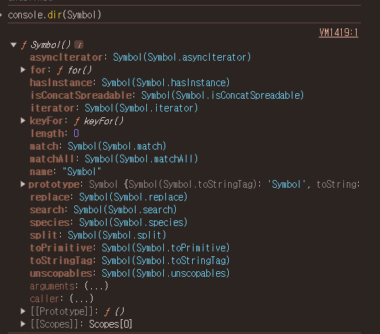

### 심볼

---

자바스크립트엔 데이터 타입이 있다.

8가지 데이터 타입

- number
- string
- boolean
- null
- undefined
- object
- symbol
- BigInt

여기서 Symbol에 관해 알아볼 것이다.

- 심볼은 변경 불가능한 원시 타입의 값으로 주로 충돌 위험이 없는 유일한 객체의 프로퍼티 키를 만들기 위해 사용한다.

```javascript
let mySymbol = Symbol();

console.log(mySymbol); // Symbol()
console.log(typeof mySymbol); // symbol
```

이렇게 생성은 Symbol()함수로 생성한다.

<br/> 

문자열을 인자로 전달할 수 있지만 생성된 심볼에 대한 설명으로만 사용된다.

```javascript
let symbolWithDesc = Symbol('ungmo2');

console.log(symbolWithDesc); // Symbol(ungmo2)
console.log(symbolWithDesc === Symbol('ungmo2')); // false
```
<br/> 


객체의 프로퍼티 키로 사용할 수 있다.

```javascript
const obj = {};

obj.prop = 'myprops';
obj['prop' + 123] = true; //123은 문자열로 바뀜
const mySymbol = Symbol('symbol');
obj[mySymbol] = 100;

console.log(obj); // {prop: 'myprops', prop123: true, Symbol(symbol): 100}
console.log(obj[mySymbol]); // 100
```
<br/> 


- Symbol 객체




이렇게 Symbol 객체는 프로퍼티와 메소드를 가지고 있다. 이 중에서 iterator과 for을 볼 것이다.

<br/> 

- Symbol.iterator   <br>
  어떤 객체가 Symbol.iterator을 프로퍼티 key로 사용한 메소드를 가지고 있으면 자바스크립트 엔진은 이 객체가 이터레이션 프로토콜을 따르는 것으로 간주하고 이터레이터로 동작하도록 한다.
  <br/> 
  여기서 이터레이션 프로토콜은 데이터를 순회하기 위한 프로토콜을 뜻하며 for of문법으로 순회할 수 있다.
  이 프로토콜을 준수한 객체를 이터러블이라고 하며 이터러블은 Symbol.iterator 메소드를 구현하거나 프로토타입 체인에 의해 상속한 객체를 말한다.

  <br/> 
  더 자세한 설명은 [여기서]()
  <br/> <br/> <br/> 

- Symbol.for   <br>
  Symbol.for 메소드는 인자로 전달받은 문자열을 키로 사용해 Symbol 값들이 저장되어 있는 전역 Symbol 레지스트리에서 해당 키와 일치하는 저장된 Symbol 값을 검색한다.
  성공하면 Symbol 값을 반환하고, 실패하면 새로운 Symbol 값을 생성하여 반환한다.

```javascript
// 전역 Symbol 레지스트리에 foo라는 키로 저장된 Symbol이 없으면 새로운 Symbol 생성
const s1 = Symbol.for('foo');
// 전역 Symbol 레지스트리에 foo라는 키로 저장된 Symbol이 있으면 해당 Symbol을 반환
const s2 = Symbol.for('foo');

console.log(s1 === s2); // true
```
