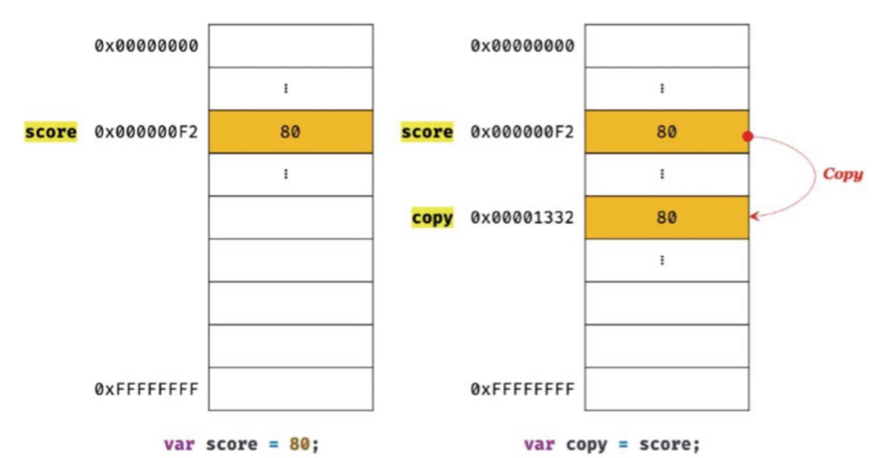

## 원시 값과 객체의 비교

자바스크립트가 제공하는 데이터 타입은 크게 **원시 타입**과 **객체 타입**으로 나뉜다.
`원시 타입`은 변경 불가능, `객체 타입`은 변경 가능한 값이다.
원시 값를 변수에 할당하면 변수(확보된 메모리 공간)에는 실제 값이 저장된다. 원시 값을 갖는 변수를 다른 변수에 할당하면 원본의 원시 값이 복사되어 전달된다.
객체를 변수에 할당하면 변수(확보된 메모리 공간)에는 참조 값이 저장된다. 객체를 가리키는 변수를 다른 변수에 할당하면 원본의 참조 값이 복사되어 전달된다.

```javascript
// 원시 값
let a = 4;
let b = a; // b엔 a의 값이 복사된다.
a = 10;
console.log(a, b); // 10 4

// 참조 값
let arr1 = [1, 2, 3];
let arr2 = arr1;
arr1.push(4);
console.log(arr1, arr2); //[1,2,3,4] [1,2,3,4]
```

위 예제에서 봤듯이 원시 값은 값이 변수에 직접 저장이 되고 참조 값은 메모리 주소를 가리킨다.

### 1. 원시 값

- 변경 불가능한 값
  원시 타입의 값은 변경 불가능한 값이다. 즉 읽기 전용값으로서 변경할 수 없다.
  값을 변경할 수 없다는 것을 구체적으로 알아보자!
  먼저 변수와 값은 구분해서 생각해야 한다.
  **변수**는 하나의 값을 저장하기 위해 확보한 메모리 공간 또는 그 공간을 식별하기 위한 이름이고, **값**은 변수에 저장된 데이터다.
  `변경 불가능하다는 것은 변수가 아니라 값에 대한 것이다!`
  즉, 원시 값 자체를 변경할 수 없는거지 변수 값을 변경하는 것은 가능한 것이다.
  원시 값을 할당한 변수에 새로운 원시 값을 재할당하면 메모리 공간에 저장되어 있는 값을 변경하는 것이 아니라 새로운 메모리 공간을 확보하고 값을 저장한다.


이처럼 값을 변경하기 위해 새로운 메모리 공간을 확보하고 재할당한 값을 저장한 후, 변수가 참조하던 메모리 공간의 주소를 변경하는 값의 특성을 **불변성**이라고 한다.

### 1-2. 문자열과 불변성

```javascript
let str = 'Hello';
str = 'world';
```

첫 번째 문이 실행되면 문자열 'Hello'가 생성되고 식별자 str은 문자열 'Hello'가 저장된 메모리 공간의 첫 번째 메모리 셀 주소를 가리킨다.

그리고 두 번째 문이 실행되면 이전에 생성된 문자열 'Hello'를 수정하는 것이 아니라 새로운 문자열 'world'를 메모리에 생성하고 식별자 'str'은 이것을 가리킨다. 그래서 'Hello'와 'wolrd' 모두 메모리에 존재하고 'str'은 단지 'Hello'에서 'world'를 가리키도록 변경된 것이다.

### 1-3. 값에 의한 전달



```javascript
let score = 80;
let copy = score;

score = 100;
```

이렇게 `score`의 원시 값을 `copy`에 전달했다. 이것을 값에 의한 전달이라고 한다.
역시 전달이기 때문에 두 변수는 다른 메모리 공간에 저장된 별개의 값이다.
그래서 다른 하나를 바꿔도 별개의 값이기 때문에 `copy`의 값은 변경되지 않는다.

> 위 그림에서는 변수에 원시 값을 갖는 변수를 할당하면 원시 값이 복사되는 것으로 표현했지만 변수에 원시 값을 갖는 변수르 할당하는 시점에는 두 변수가 같은 원시 값을 참조하다가 어느 한쪽의 변수에 재할당이 이뤄졌을 때 비로소 새로운 메모리 공간에 재할당된 값을 저장하도록 동작할 수도 있다. 참고로 파이썬은 이처럼 동작한다. '값에 의한 동작'이라는 용어 역시 ECMAScript 사양에는 등장하지 않는다. '공유에 의한 전달'이라고 표현하는 경우도 있다. 엄격히 말하면 변수에 값이 전달되는 것이 아니라 메모리 주소가 전달된다. 변수와 같은 식별자는 값이 아니라 메모리 주소를 기억하고 있기 때문이다. 때문에 값을 전달하는 것이 아니라 메모리 주소를 전달하는 것이다. 단, 전달된 메모리 주소를 통해 메모리 공간에 접근하면 값을 참조할 수 있다. 제일 중요한 점은 두 변수의 원시 값은 서로 다른 메모리 공간에 저장된 별개의 값이란 것이다.

### 2. 객체
