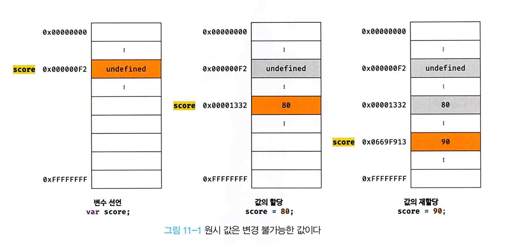

### 원시 값과 객체의 비교

자바스크립트가 제공하는 데이터 타입은 크게 **원시 타입**과 **객체 타입**으로 나뉜다.
`원시 타입`은 변경 불가능, `객체 타입`은 변경 가능한 값이다.
원시 값를 변수에 할당하면 변수(확보된 메모리 공간)에는 실제 값이 저장된다. 원시 값을 갖는 변수를 다른 변수에 할당하면 원본의 원시 값이 복사되어 전달된다.
객체를 변수에 할당하면 변수(확보된 메모리 공간)에는 참조 값이 저장된다. 객체를 가리키는 변수를 다른 변수에 할당하면 원본의 참조 값이 복사되어 전달된다.

```javascript
// 원시 값
let a = 4;
let b = a; // b엔 a의 값이 복사된다.
a = 10;
console.log(a, b); // 10 4

// 참조 값
let arr1 = [1, 2, 3];
let arr2 = arr1;
arr1.push(4);
console.log(arr1, arr2); //[1,2,3,4] [1,2,3,4]
```

위 예제에서 봤듯이 원시 값은 값이 변수에 직접 저장이 되고 참조 값은 메모리 주소를 가리킨다.

1. 원시 값

- 변경 불가능한 값
  원시 타입의 값은 변경 불가능한 값이다. 즉 읽기 전용값으로서 변경할 수 없다.
  값을 변경할 수 없다는 것을 구체적으로 알아보자!
  먼저 변수와 값은 구분해서 생각해야 한다.
  **변수**는 하나의 값을 저장하기 위해 확보한 메모리 공간 또는 그 공간을 식별하기 위한 이름이고, **값**은 변수에 저장된 데이터다.
  `변경 불가능하다는 것은 변수가 아니라 값에 대한 것이다!`
  즉, 원시 값 자체를 변경할 수 없는거지 변수 값을 변경하는 것은 가능한 것이다.
  원시 값을 할당한 변수에 새로운 원시 값을 재할당하면 메모리 공간에 저장되어 있는 값을 변경하는 것이 아니라 새로운 메모리 공간을 확보하고 값을 저장한다.


