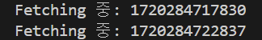

## 동시에 리퀘스트하기

이번엔 동시에 리퀘스트하는 법을 알아보자.

똑같이 fetch를 하는데 이번엔 동시에 두 개를 할 것이다.

```typescript
import { API_URL } from '../../../(home)/page';

async function getMovie(id: string) {
  const response = await fetch(`${API_URL}/${id}`);
  return response.json();
}

async function getVideo(id: string) {
  const response = await fetch(`${API_URL}/${id}/videos`);
  return response.json();
}

export default async function MovieDetail({ params: { id } }: { params: { id: string } }) {
  const movie = await getMovie(id);
  const videos = await getVideo(id);
  return (
    <div>
      <h1>{movie.title}</h1>
      <h2>{videos.title}</h2>
    </div>
  );
}
```

근데 이렇게 하면 처음 함수가 완료될 때 까지 다음 함수는 실행되지 않는다는 문제가 있다.

각 함수에

```typescript
await new Promise((resolve) => setTimeout(resolve, 5000));
```

await을 추가해준다. 그리고 console도 찍어서 동시에 되는 지 확인해 보자.



보면 이렇게 순차적으로 실행되는 것을 알 수 있다! 이러면 처음 함수가 느려지면 다음 함수의 실행도 느려지기 때문에 수정해주자.

<br>
<br>

먼저 이 부분을 고쳐준다.

```typescript
const movie = await getMovie(id);
const videos = await getVideo(id);

//이 부분을 아래처럼 바꾼다.

const [movie, videos] = await Promise.all([getMovie(id), getVideo(id)]);
```

`Promise.all`은 함수들을 await 시키고 결과를 배열로 내보내기 때문에 배열로 정의해야 한다.

그리고 다시 콘솔을 확인해 보면 동시에 실행되는 것을 확인할 수 있다.

하지만 이보다 더 좋은 방법이 있는데 `suspense`라고 이건 다음 장에서 알아보자.
