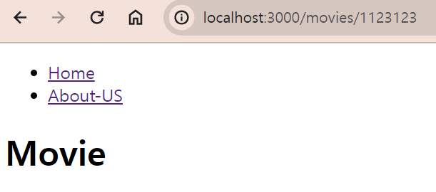

## Dynamic Routes

dynamic route란 링크 뒤에 변수가 붙은 URL을 말한다.
리액트에선 `/movie/:id` 이런 식으로 해서 URL을 만들어 본 적이 있을 것이다. 이렇게 URL에 변수가 있는 게 다이나믹 라우트다.

Next에선 폴더로 만들면 된다.

 
이렇게 `대괄호`를 사용해서 폴더를 만들면 Next에선 movies뒤에 무엇이 들어가도 된다고 인식한다. 물론 [id]라고 만든 폴더 안에 page파일이 있어야 한다.

 

그럼 이렇게 movies뒤에 뭐가 있어도 오류가 발생하지 않고 잘 표시되는 것을 볼 수 있다.
