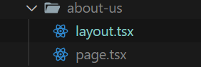
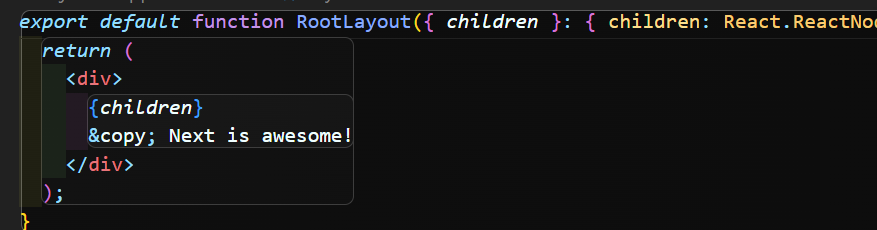

## layout

layout파일은 Next를 만들면 자동으로 만들어 지는 파일이다. 이 파일은 말 그래도 레이아웃을 만들어 주는 파일인데 각 페이지 마다 다른 레이아웃을 만들 수 있다.

방법은 간단하다. 만들고자 하는 폴더에 layout파일을 만들어 준다.

여기서 주의할 점은 페이지별 레이아웃을 만들 땐 `<html>`태그나 `<body>` 태그를 지워야 한다. 이러면 about-us 페이지에만 레이아웃이 추가된 것을 확인할 수 있다!

즉, layout파일은 하위폴더로 가면서 layout파일을 확인하고 파일이 있다면 그 레이아웃 파일을 사용해서 렌더링한다.

 

`getLayout`이라는 메서드를 사용해 자체적으로 레이아웃을 정할 수 있다!
