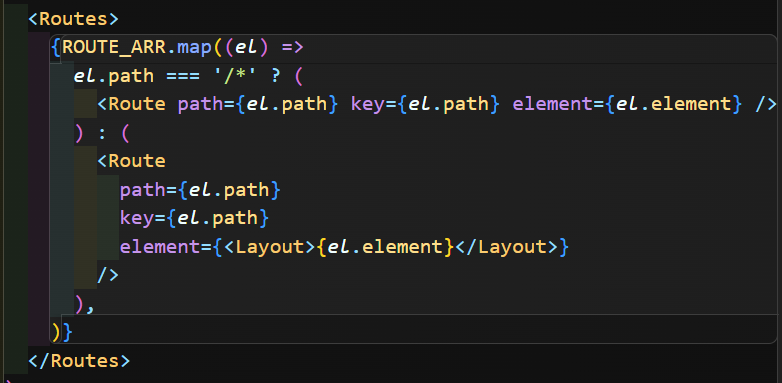
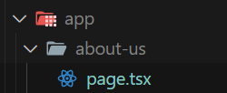
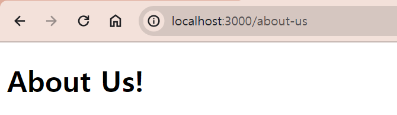

## NextJS의 Routing

### 라우트 정의하기

리액트 라우트는 해당 url에 해당되는 컴포넌트를 로드하는 코드를 짰었다.

( 예시 )

하지만 Next에선 이렇게 하지 않아도 된다.

먼저 **app** 하위에 있는 **page**라는 파일은 홈페이지('/')가 된다.

만약 새로운 페이지를 만들고 싶다면 app파일 아래 해당하는 url의 폴더를 만들면 된다.

그럼 Next는 해당 폴더를 라우트로 인식하게 된다.

이제 만든 폴더에 똑같이 page 파일을 만들고 export하면 된다.

이렇게 /about-us로 들어가면 페이지가 나오는 것을 확인할 수 있다!!
