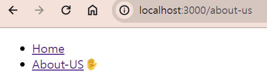

## NextJS의 Routing

### 1. 라우트 정의하기

react-route-dom은 해당 url에 해당되는 컴포넌트를 로드하는 코드를 수동으로 만들었었다.

( 예시 )


<br>

하지만 Next에선 이렇게 하지 않아도 된다.

<br>

먼저 **app** 하위에 있는 **page**라는 파일은 홈페이지('/')가 된다.

`만약 새로운 페이지를 만들고 싶다면 app파일 아래 해당하는 url의 폴더를 만들고 page파일을 만들면 된다.`

그럼 Next는 해당 폴더를 라우트로 인식하게 된다.

이제 만든 폴더에 똑같이 page 파일을 만들고 export하면 된다.


이렇게 /about-us로 들어가면 페이지가 나오는 것을 확인할 수 있다!!

<br>

만약 url을 더 깊게 만들고 싶다면 해당 폴더 아래에 url이 될 폴더를 만들고 그 아래 page라는 파일을 만들면 된다. 만약 page 파일을 만들지 않는다면 url로서 작동하지 않는 파일이 된다.


<br>
<br>
<br>

---

### 2. Not found Routes

404 페이지를 본 적이 있을 것이다. 보통 404 페이지들이 다 디자인 되어 있을텐데 폴더 이름으로 url을 정하는 Next에선 어떻게 구현할까?

답은 app폴더 아래 `not-found` 파일을 만들면 된다. 그리고 똑같이 export하면은


이렇게 만들지 않은 url에서 작동하게 된다.

Next엔 몇몇 특정한 이름을 가진 파일이 있는데 `page`, `layout`, `not-found`가 그런 파일 중 일부이다. 이 파일들은 특정 기능을 하기 때문에 꼭 이렇게 써야한다.

<br>

---

### 3. 네비게이션 바 만들어 보기

app폴더와 같은 위치에 components라는 폴더를 만들고 그 안에 navigation 컴포넌트를 만들어 주자. 간단하게 ul과 li만을 사용해서 만드는데 `<a>`태그는 사용하지 않을 것이다. 대신에 `Link`라는 컴포넌트를 import해서 사용할 것이다.


이제 `Link`를 각 li에 붙여준다면 간단한 네비게이션 바가 만들어졌다.

그럼 이제 이걸 각 페이지에 넣어줘야 하는데 물론 일일히 넣을 수도 있겠지만 `layout` 파일에 navigation 컴포넌트를 넣어주면 훨씬 편하다.

그럼 이제 모든 페이지에 네비게이션 바가 들어간 것을 확인할 수 있다!!

<br>

이번엔 url에 따라 해당 url의 네비게이션 바 옆에 이모지를 붙여보자.
그럴려면 어떤 url에 있는 지를 알아야 하는데 next에는 `usePathname`이라는 hook이 있다. 이 hook을 사용해서 보면...

```typescript
import Link from 'next/link';
import { usePathname } from 'next/navigation';

export default function Navigation() {
  const path = usePathname();
  return (
    <nav>
      <ul>
        <li>
          <Link href={'/'}>Home</Link>
          {path === '/' ? '✋' : ''}
        </li>
        <li>
          <Link href={'/about-us'}>About-US</Link>
          {path === '/about-us' ? '✋' : ''}
        </li>
      </ul>
    </nav>
  );
}
```


이런 에러를 확인할 수 있을 것이다. 이 에러에 따라서 맨 위에 `"use client"`를 넣어주면



이렇게 잘 작동되는 것을 볼 수 있을 것이다!

use client에 대해선 다음 장에서 알아보자.
