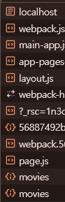
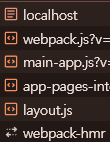

## server-component

이번엔 client side에서 server side로 컴포넌트를 만들 것이다.

원래 코드에서 필요 없는 부분을 삭제한 뒤, metadata도 넣어준다.

```typescript
export const metadata = {
  titile: 'Home',
};

const URL = 'https://nomad-movies.nomadcoders.workers.dev/movies';

export default function HomePage() {
  return <div>{JSON.stringify(movies)}</div>;
}
```

<br>

이제 data를 fetch할 건데 server component에선 component 안에 넣지 않아도 된다.

```typescript
async function getMovies() {
  return fetch(URL).then((response) => response.json());
}
```

일단 이렇게 함수를 만든다. 기능은 client-side에서 만든 fetch 코드와 기능은 같다.

<br>

그리고 `HomePage` 함수를 데이터를 fetch하기 위해 async로 바꾸고 `await getMovies`를 넣어준다.

```typescript
//최종
export const metadata = {
  titile: 'Home',
};

const URL = 'https://nomad-movies.nomadcoders.workers.dev/movies';

async function getMovies() {
  return fetch(URL).then((response) => response.json());
}

export default async function HomePage() {
  const movies = await getMovies();
  return <div>{JSON.stringify(movies)}</div>;
}
```

이러면 잘 작동이 된다!

<br>

```typescript
//client side 코드
'use client';

import { useEffect, useState } from 'react';

export default function page() {
  const [movies, setMovies] = useState([]);
  const [isLoading, setIsLoading] = useState(true);
  const getMovies = async () => {
    const response = await fetch('https://nomad-movies.nomadcoders.workers.dev/movies');
    const json = await response.json();
    setMovies(json);
    setIsLoading(false);
  };

  useEffect(() => {
    getMovies();
  }, []);
  return <div>{isLoading ? 'Loading...' : JSON.stringify(movies)}</div>;
}

//----------------------------------------------------------------------
//server side 코드
export const metadata = {
  titile: 'Home',
};

const URL = 'https://nomad-movies.nomadcoders.workers.dev/movies';

async function getMovies() {
  return fetch(URL).then((response) => response.json());
}

export default async function HomePage() {
  const movies = await getMovies();
  return <div>{JSON.stringify(movies)}</div>;
}
```

<br>

육안으로만 봐도 훨씬 간단해 졌다.

<br>

여기서 client와 server component의 차이점을 알 수 있다.

먼저 브라우저의 Network탭에 들어가서 차이점을 보자.



이건 client component였을 때의 탭이고,



이건 server component였을 때의 탭이다.

server component일 땐 브라우저에서 movie에 관환 fetch를 안 했다는 것을 알 수 있다.

오직 백엔드에서만 fetch 한다. `getMovies`함수에 console을 찍어보면 브라우저엔 아무것도 나오지 않는 것을 볼 수 있다.

---

<br>

하지만 로딩 역시 존재한다. server component에서 Next Js가 내가 fetch한 것을 기억하기 때문에 로딩이 매우 빠르게 지나가지만 존재한다.

다음엔 loading시에 UI 페이지를 만들어 보자.
