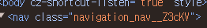

## CSS 모듈

Next에선 css 모듈을 별도의 설치 없이 바로 사용 가능하다.

먼저 global css파일을 만드려면 app에 바로 만들어도 상관없는데 styles라는 파일을 만들고 그 아래 만들어도 된다.

만든 css를 root인 layout에 import하자.

---

이번엔 css모듈이 어떻게 작동하는 지 알아보자.

먼저 컴포넌트 폴더 안에 있는 컴포넌트들도 꾸미고 싶다!

방법은 두 가지가 있다.

1. components 폴더로 가서 원하는 파일의 이름 + `.module.css` 로 설정하기 (ex. navigation.module.css)

2. styles 폴더에 똑같이 만들기

요점은 `이름+.module.css`로 만들어야 한다는 점이다.

<br>

```css
.nav {
  background-color: red;
}
```

먼저 이렇게 만들건데 보면 class로 만들었다. 그러면 이걸 navigation 코드에 어떻게 적용 시킬까??

흔히 생각하기로 **className = 'nav'** 이렇게 할 수도 있다. 하지만 이 경우엔 global css와 같이 쓰면 className이 겹칠 수도 있는 문제가 있다.

그렇다면 어떻게 해야할까??

```typescript
import styles from '../app/styles/navigation.module.css';

export default function Navigation() {
  const path = usePathname();
  return (
    <nav className={styles.nav}>
```

이렇게 `import styles`하고 `className을 styles.nav` 이렇게 한다.

그러니까 inport styles 에서 styles를 모든 class들을 지닌 JavaScript Object라고 생각하자.

이렇게 하면 실제 className은 nav가 아닌 랜덤하게 표시된다.
그래서 충돌 걱정이 없다.



중요한 건 모두 `.`으로 시작해서 class라는 것을 알려야 한다!
그게 아니라면 global css나 이런데다가 넣어야 한다

> module.css는 클래스로 스타일을 만든다고 생각하자.

```typescript
  <li className={styles.list}>
```

이런 식으로 class를 만들어서 넣는다고 생각하자.

<br>
<br>
<br>

물론 폴더 지정 방식은 다양하게 하면 된다. styles를 만들어서 따로 빼도 되고, 컴포넌트 폴더 안에 각 컴포넌트 폴더를 만들어서 그 안에 tsx랑 css 넣어도 된다.

컴포넌트의 양이 적다면 한 styles 폴더 안에 다 넣어도 되겠지만 만약 components의 양이 많다면 각 conponents 폴더 안에 styles 파일을 넣으면 더 깔끔해 보일 것이다! 역시 이건 선택사항이다.
