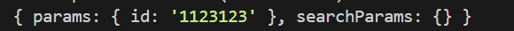

## Dynamic Routes

**dynamic route**란 링크 뒤에 변수가 붙은 URL을 말한다.
리액트에선 `/movie/:id` 이런 식으로 해서 URL을 만들어 본 적이 있을 것이다. 이렇게 URL에 변수가 있는 게 다이나믹 라우트다.

Next에선 폴더로 만들면 된다.


<br>

이렇게 `대괄호`를 사용해서 폴더를 만들면 Next에선 movies뒤에 무엇이 들어가도 된다고 인식한다. 물론 **[id]라고 만든 폴더 안에 page파일이 있어야 한다.**

<br>


그럼 이렇게 movies뒤에 뭐가 있어도 오류가 발생하지 않고 잘 표시되는 것을 볼 수 있다.

---

<br>
이번엔 진짜 웹사이트 처럼 movies/id 이런 형식으로 만들어 보자.
그러려면 일단 어떤 props를 받는지 확인 해 보자.

<br>

```typescript
export default function MovieDetail(props) {
  console.log(props);
  return <h1>Movie</h1>;
}
```



이렇게 id 형식으로 받는 것을 볼 수 있다. **이건 폴더 이름을 id라고 했기 때문이다.** 만약 폴더 이름이 apple이였다면 apple: '1123123'이라고 나왔을 것이다.

<br>


만약 url이 이렇다면
<br>


이렇게 나온다.

> 그러니까 Next는 **폴더 이름을 통해 params를 설정**하고 **searchParams는 URL의 쿼리 문자열 부분을 나타낸다.** 참고로 ? 뒤에 있는 애들이 쿼리 문자열이다.

<br>

```typescript
export default function MovieDetail({ params: { id } }: { params: { id: string } }) {
  return <h1>Movie {id}</h1>;
}
```

내가 필요한 params는 id니까 이렇게 해주면 id가 나온다.
