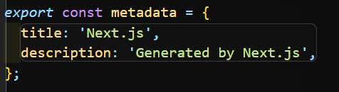
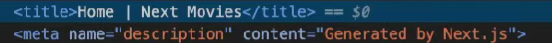
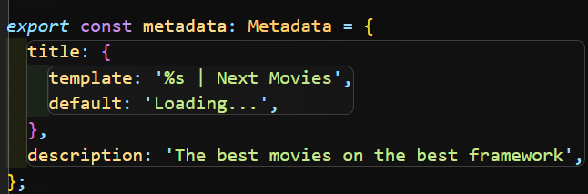

## metadata

### route groups

`route groups`는 routes들을 그룹화해서 logical groups로 만들 수 있다. 또한 루트 레이아웃을 사용하지 않고 대신 여러 레이아웃을 선택해서 사용할 수도 있다. 예를 들어 중첩 레이아웃을 원하지 않는 경우 route groups를 활용할 수 있다.

- 방법  
  먼저 app폴더 아래에 (home)이라는 폴더를 만들고 app폴더 아래 있는 page파일을 (home)폴더로 넣는다. 이런 식으로 `route groups는 폴더 이름을 괄호로 묶어야 한다.` 괄호로 묶어서 만들면 URL로 인식하지 않는다. 괄호 외에 이름은 마음대로 하면 된다. 왜 page파일만 옮겼냐면 page파일은 하나의 페이지에서만 유효하기 때문이다. 지금 내 파일에선 이 page파일은 홈페이지에 쓰일 파일이니까 이름을 home이라고 한 것이다. 나머지 **layout**이나 **not-found** 파일은 모든 폴더에 적용되는 파일이니까 그대로 둔다.

 

---

 

### metadata

메타데이터란 꼭 내보내야 하는 object이고 metadata라고 불린다.

metadata안에 뭐가있든 head에 포함된다. 수정하고 싶다면 이 안을 수정하면 그대로 반영된다.

그럼 이제 원래 layout파일에 있던 이 metadata코드를 위에서 옮긴 (home)폴더 안에 있는 page 파일에 붙여넣으면 이 metadata코드는 오직 홈페이지에서만 나오게 된다.

이 meatadata는 layout처럼 중첩이 가능한 코드이기 때문에 description은 layout에 두고 title은 page폴더에 옮겨도 둘이 중첩된다. 하지만 title은 다른 페이지에선 나오지 않는다!

그럼 이제 똑같은 방법으로 다른 폴더에도 page파일에 metadata를 넣어주면 페이지마다 다른 meatadata가 적용된다.

> 중요한 점은 `page`나 `layout`, `not-found`파일같은 특정 파일에만 **metadata**를 내보낼 수 있다.

 

보면 title에 `| Next Moveis` 부분이 계속 반복되고 있다. 이것도 레이아웃을 만들 수 있다.

이렇게 쓰면 되는데 타입스크립트일 경우 :Metadata를 쓰면 Next에서 제공하는 기능을 사용할 수 있어서 좋다. title은 문자열이 아니여도 되기 때문에 객체로 사용할 수 있다. 이 안에 제공할 `template`과 `default`값을 넣어주면 된다!

not-found파일에도 메타데이터를 넣을 수 있기 때문에 not-found파일에도 적용해주자.

 
 

---

https://nextjs.org/docs/app/building-your-application/optimizing/metadata
