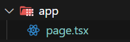
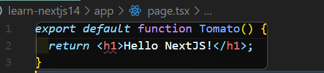
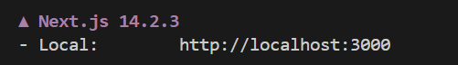
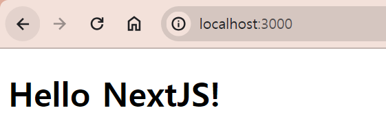
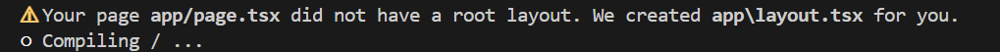

## Next 초기 설정 직접 시작해보기

### 1. 라이브러리 vs 프레임워크

React는 라이브러리, Next는 프레임워크다. <br>
**라이브러리**는 코드 내에서 내가 사용하는 즉, 내가 뭘 어떻게 어디에 사용할 지 선택해서 사용하는 것으로 React는 UI 인터페이스를 build하는데 사용한다. **프레임워크는** 나한테 주도권이 있지 않고 프레임워크가 내 코드를 사용하는 것이다. React는 내가 import해서 사용했지만 Next는 내가 얘한테 맞춰서 코드를 짜서 export한다.

---

<br>

### 2. Next 수동 설치

먼저 npm 설치해주고, react, react-dom, next 최신 버전을 설치한다.

```
npm init -y
npm i react@latest next@latest react-dom@latest
```

<br>

그리고 package.json에서 scripts 부분을 "dev": "next dev" 이걸로 바꾸면 dev라는 명령어가 next를 실행할 것이다. 실행된 next는 page라는 파일을 찾으려고 할 것이다. 그리고 그 page라는 파일은 app이라는 폴더 안에 있어야 하므로 그렇게 만들어 준다. tsx로 하든지 jsx로 하든지 그건 맘대로 하면 된다.



<br>

이제 만든 page 파일에서 export를 해보자. 이름은 중요하지 않지만 이 컴포넌트가 default로 export 돼야 한다.



<br>

그리고 npm run dev로 실행시켜주면!



<br>

이런 저런 설명이 나오면서 localhost 3000으로 된 것을 볼 수 있다!
그럼 이제 저곳으로 가면



짜잔! 아무것도 설정하지 않고 next만 설치했을 뿐인데 연결이 된 것을 확인할 수 있다!!

<br>

그리고 터미널을 확인해보면 이런 글귀를 볼 수 있다.


app 폴더에 layout파일이 자동으로 설치되었다는 것을 확인할 수 있다!

<br>
<br>
<br>

---

### 요약

- React는 라이브러리, Next는 프레임 워크다.
- 수동으로 설치하기 위해선 먼저 npm i로 react, react-dom, next를 설치한 후 package.json에서 next dev 실행 코드를 작성한다.
- next는 **app**이라는 폴더 안의 **page**라는 파일을 참조하기 때문에 만들어 준 후 page파일에 default로 export할 함수를 만들어 준다.
